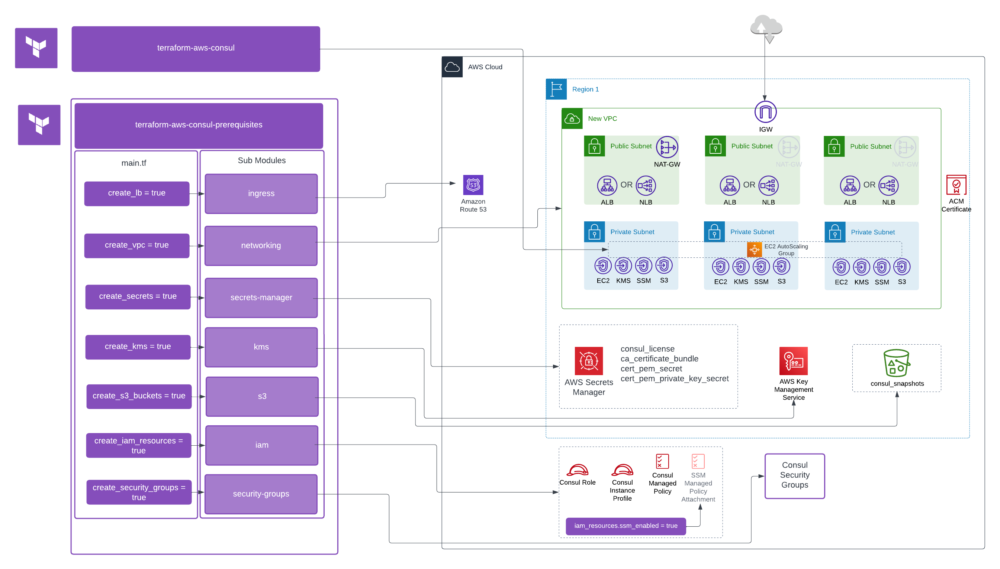

# Consul Enterprise on AWS Prereqs
This Terraform module is intended to assist with the provisioning of prerequisite resources that are required for a Consul Enterprise on AWS deployment. Every environment is different, and so this module may not be all-encompassing for every situation. However, this module calls upon submodules that are flexible for the core resources that are necessary in common deployment scenarios.  Utilizing this module in combination with the [terraform-aws-consul](https://github.com/hashicorp-modules/terraform-aws-consul) will deploy a complete Consul Enterprise deployment inside of AWS.  The separation of the two modules is to limit blast radius from issues with either modules constructs.  

---

## Purpose
These modules are currently for [hyper-specialized tier partners](https://www.hashicorp.com/partners/find-a-partner?category=systems-integrators), internal use, and HashiCorp Implementation Services. Please reach out in #team-ent-deployment-modules if you want to use this with your customers.

## Usage
This module utilizes submodules that are required components for a Consul Enterprise installation on AWS. These modules are created in such a way that a calling root module can indicate whether or not specific parameters are customized by the caller, or left as defaults. In addition, each of the submodules can be enabled or disabled via boolean values that match the naming convention of `create_<module>`.   

Each submodule has various input variables that have sane defaults applied such that callers should be able to deploy Consul Enterprise pre-requisites onto AWS with minimal input.  However, variables exist for multiple custom configurations of each of the submodules.  Please see the variable inputs to determine what settings can be set as well as their defaults.  In addition, refer to the [Example Scenarios](#example-scenarios) section for different deployment example types.  All that is required to deploy is populating your own variable values in the `terraform.auto.tfvars` template that is provided in the given scenario subdirectory.  

An overview of the module architecture is provided in [LucidChart](https://lucid.app/lucidchart/d5c38e57-21c1-4eb9-a458-8f89cb9a074f/edit?viewport_loc=-1438%2C-1413%2C2868%2C1494%2Cm-XochyQaYXD&invitationId=inv_8dd8a03b-70d3-4d7e-b236-4f0387817611) . Each submodule is stored as a layer such that you can enable/disable their view as it relates to the architecture.  This can be toggled by selecting the layer button on the turning on and off the visibility of each layer as needed.  

---  

## High Level Overview

Here is a high level overview for those that are unable to access the Lucid url. This outlines what components are created based on the boolean values that are supplied and the submodules that are executed as a result.



---

## 📝 Note
If you already have the prerequisites created, please see the other repository for the examples that focus on the deployment of the product only rather than the underlying infrastructre.

| Example | Description |
| ------- | ----------- |
|[private-consul-5-node-route53-nlb](https://github.com/hashicorp-modules/terraform-aws-consul/tree/main/examples/private-consul-5-node-route53-nlb)| Consul Enterprise deployment only, customer builds all prerequisite infrastructure. Assumes 5 nodes with an NLB and optionally an outbound Route53 Resolver. |
|[public-consul-5-node-nlb](https://github.com/hashicorp-modules/terraform-aws-consul/tree/main/examples/public-consul-5-node-nlb)| Consul Enterprise deployment only, customer builds all prerequisite infrastructure. Assumes 5 nodes with an NLB |
--- 
 
## 📂 Example scenarios and structure

The Git repository contains the following directories under `examples` and should be used as references when consuming the module

```sh
📁 examples                                             # Root example folder
├─📁 private-consul-5-node-route53-nlb                  # Example where the module builds all of the prerequisites and deploys a private Consul cluster with an NLB and Route53 resolver
├─📁 public-consul-5-node-nlb                           # Example where the module builds all of the prerequisites and deploys a public Consul cluster with an NLB
```

---

## Licensing Consul Enterprise  
The Consul Enterprise license will be uploaded into Secrets Manager and will be required by Consul.  Ensure that you have a Consul Enterprise license in the same directory of your calling module to ensure that it is uploaded into Secrets Manager.  The details from Secrets Manager will be pulled into the `user_data` of the EC2 at boot to configure Consul.  For more information, view the `Readme` in the Secrets Manager Module  

---  

## Submodules in use:

- [terraform-aws-ent-prereq-networking](https://github.com/hashicorp-modules/terraform-aws-ent-prereq-networking)
- [terraform-aws-ent-prereq-s3](https://github.com/hashicorp-modules/terraform-aws-ent-prereq-s3)
- [terraform-aws-ent-prereq-ingress](https://github.com/hashicorp-modules/terraform-aws-ent-prereq-ingress)
- [terraform-aws-ent-prereq-kms](https://github.com/hashicorp-modules/terraform-aws-ent-prereq-kms)
- [terraform-aws-ent-prereq-iam](https://github.com/hashicorp-modules/terraform-aws-ent-prereq-iam)
- [terraform-aws-ent-prereq-secrets-manager](https://github.com/hashicorp-modules/terraform-aws-ent-prereq-secrets-manager)
- [terraform-null-cloudinit-function-template](https://github.com/hashicorp-modules/terraform-null-cloudinit-function-template)
- [terraform-aws-ent-prereq-sg](https://github.com/hashicorp-modules/terraform-aws-ent-prereq-sg)
- [route53_resolver](https://github.com/hashicorp-modules/terraform-aws-consul-prerequisites/tree/main/modules/route53_resolver)

<!-- BEGIN_TF_DOCS -->
## Requirements

| Name | Version |
|------|---------|
| <a name="requirement_terraform"></a> [terraform](#requirement\_terraform) | >= 1.4.0 |
| <a name="requirement_aws"></a> [aws](#requirement\_aws) | >=4.55.0 |
| <a name="requirement_random"></a> [random](#requirement\_random) | >=3.5.1 |

## Providers

| Name | Version |
|------|---------|
| <a name="provider_aws"></a> [aws](#provider\_aws) | >=4.55.0 |
| <a name="provider_random"></a> [random](#provider\_random) | >=3.5.1 |

## Modules

| Name | Source | Version |
|------|--------|---------|
| <a name="module_iam"></a> [iam](#module\_iam) | github.com/hashicorp-modules/terraform-aws-ent-prereq-iam | v0.1.0 |
| <a name="module_ingress"></a> [ingress](#module\_ingress) | github.com/hashicorp-modules/terraform-aws-ent-prereq-ingress | v1.0.0 |
| <a name="module_kms"></a> [kms](#module\_kms) | github.com/hashicorp-modules/terraform-aws-ent-prereq-kms | v0.2.1 |
| <a name="module_networking"></a> [networking](#module\_networking) | github.com/hashicorp-modules/terraform-aws-ent-prereq-networking | v0.2.0 |
| <a name="module_route53_resolver"></a> [route53\_resolver](#module\_route53\_resolver) | ./modules/route53_resolver | n/a |
| <a name="module_s3"></a> [s3](#module\_s3) | github.com/hashicorp-modules/terraform-aws-ent-prereq-s3 | v0.0.4 |
| <a name="module_secrets_manager"></a> [secrets\_manager](#module\_secrets\_manager) | github.com/hashicorp-modules/terraform-aws-ent-prereq-secrets-manager | v1.0.0 |
| <a name="module_sg"></a> [sg](#module\_sg) | github.com/hashicorp-modules/terraform-aws-ent-prereq-sg | v0.1.0 |

## Resources

| Name | Type |
|------|------|
| [aws_cloudwatch_log_group.consul](https://registry.terraform.io/providers/hashicorp/aws/latest/docs/resources/cloudwatch_log_group) | resource |
| [aws_key_pair.ssh](https://registry.terraform.io/providers/hashicorp/aws/latest/docs/resources/key_pair) | resource |
| [random_id.pre_req_rid](https://registry.terraform.io/providers/hashicorp/random/latest/docs/resources/id) | resource |
| [aws_region.current](https://registry.terraform.io/providers/hashicorp/aws/latest/docs/data-sources/region) | data source |

## Inputs

| Name | Description | Type | Default | Required |
|------|-------------|------|---------|:--------:|
| <a name="input_friendly_name_prefix"></a> [friendly\_name\_prefix](#input\_friendly\_name\_prefix) | Friendly name prefix used for tagging and naming AWS resources. | `string` | n/a | yes |
| <a name="input_iam_resources"></a> [iam\_resources](#input\_iam\_resources) | A list of objects for to be referenced in an IAM policy for the instance.  Each is a list of strings that reference infra related to the install | <pre>object({<br>    bucket_arns             = optional(list(string), [])<br>    kms_key_arns            = optional(list(string), [])<br>    secret_manager_arns     = optional(list(string), [])<br>    log_group_arn           = optional(string, "")<br>    log_forwarding_enabled  = optional(bool, true)<br>    role_name               = optional(string, "deployment-role")<br>    policy_name             = optional(string, "deployment-policy")<br>    ssm_enable              = optional(bool, false)<br>    custom_tbw_ecr_repo_arn = optional(string, "")<br>  })</pre> | n/a | yes |
| <a name="input_asg_service_iam_role_custom_suffix"></a> [asg\_service\_iam\_role\_custom\_suffix](#input\_asg\_service\_iam\_role\_custom\_suffix) | Custom suffix for the AWS Service Linked Role.  AWS IAM only allows unique names.  Leave blank with create\_asg\_service\_iam\_role to create the Default Service Linked Role, or add a value to create a secondary role for use with this module | `string` | `""` | no |
| <a name="input_cloudwatch_kms_key_arn"></a> [cloudwatch\_kms\_key\_arn](#input\_cloudwatch\_kms\_key\_arn) | KMS key that cloudwatch will use. If not specified, the kms key that is created will be used. | `string` | `null` | no |
| <a name="input_common_tags"></a> [common\_tags](#input\_common\_tags) | Map of common tags for all taggable AWS resources. | `map(string)` | `{}` | no |
| <a name="input_create_asg_service_iam_role"></a> [create\_asg\_service\_iam\_role](#input\_create\_asg\_service\_iam\_role) | Boolean to create a service linked role for AWS Auto Scaling.  This is required to be created prior to the KMS Key Policy.  This may or may not exist in an AWS Account and needs to be explicilty determined | `bool` | `false` | no |
| <a name="input_create_iam_resources"></a> [create\_iam\_resources](#input\_create\_iam\_resources) | Flag to create IAM Resources | `bool` | `true` | no |
| <a name="input_create_kms"></a> [create\_kms](#input\_create\_kms) | Boolean that when true will create the KMS keys for the S3 buckets to use | `bool` | `true` | no |
| <a name="input_create_lb"></a> [create\_lb](#input\_create\_lb) | Boolean value to indicate to create a LoadBalancer | `bool` | `true` | no |
| <a name="input_create_lb_certificate"></a> [create\_lb\_certificate](#input\_create\_lb\_certificate) | Boolean that when true will create the SSL certificate for the ALB to use. | `bool` | `true` | no |
| <a name="input_create_lb_security_groups"></a> [create\_lb\_security\_groups](#input\_create\_lb\_security\_groups) | Boolean that when true will create the required security groups for the load balancers to use. | `bool` | `true` | no |
| <a name="input_create_log_group"></a> [create\_log\_group](#input\_create\_log\_group) | Boolean that when true will create the cloud watch log group. | `bool` | `true` | no |
| <a name="input_create_s3_buckets"></a> [create\_s3\_buckets](#input\_create\_s3\_buckets) | Boolean that when true will create the S3 buckets required for the installation | `bool` | `true` | no |
| <a name="input_create_secrets"></a> [create\_secrets](#input\_create\_secrets) | Boolean that when true will create the required secrets and store them in AWS Secrets Manager for the installation. If this is not set to true then the ARNs for the required secrets must be specified | `bool` | `true` | no |
| <a name="input_create_security_groups"></a> [create\_security\_groups](#input\_create\_security\_groups) | Boolean that when true will create the required security groups for the product you are deploying | `bool` | `true` | no |
| <a name="input_create_ssh_keypair"></a> [create\_ssh\_keypair](#input\_create\_ssh\_keypair) | Boolean to deploy SSH key pair. This does not create the private key, it only creates the key pair with a provided public key. | `bool` | `false` | no |
| <a name="input_create_vpc"></a> [create\_vpc](#input\_create\_vpc) | Boolean that when true will create a VPC for Terraform Enterprise to use. If this is false then a vpc\_id must be provided. | `bool` | `true` | no |
| <a name="input_kms_allow_asg_to_cmk"></a> [kms\_allow\_asg\_to\_cmk](#input\_kms\_allow\_asg\_to\_cmk) | Boolen to create a KMS CMK Key policy that grants the Service Linked Role AWSServiceRoleForAutoScaling permissions to the CMK. | `bool` | `true` | no |
| <a name="input_kms_asg_role_arns"></a> [kms\_asg\_role\_arns](#input\_kms\_asg\_role\_arns) | List of ARNs of AWS Service Linked role for AWS Autoscaling. | `list(string)` | `[]` | no |
| <a name="input_kms_default_policy_enabled"></a> [kms\_default\_policy\_enabled](#input\_kms\_default\_policy\_enabled) | Enables a default policy that allows KMS operations to be defined by IAM | `string` | `true` | no |
| <a name="input_kms_key_deletion_window"></a> [kms\_key\_deletion\_window](#input\_kms\_key\_deletion\_window) | Duration in days to destroy the key after it is deleted. Must be between 7 and 30 days. | `number` | `7` | no |
| <a name="input_kms_key_description"></a> [kms\_key\_description](#input\_kms\_key\_description) | Description that will be attached to the KMS key (if created) | `string` | `"AWS KMS Customer-managed key to encrypt TFE RDS, S3, EBS, etc."` | no |
| <a name="input_kms_key_name"></a> [kms\_key\_name](#input\_kms\_key\_name) | Name that will be added to the KMS key via tags | `string` | `"kms-key"` | no |
| <a name="input_kms_key_usage"></a> [kms\_key\_usage](#input\_kms\_key\_usage) | Intended use of the KMS key that will be created. | `string` | `"ENCRYPT_DECRYPT"` | no |
| <a name="input_kms_key_users_or_roles"></a> [kms\_key\_users\_or\_roles](#input\_kms\_key\_users\_or\_roles) | List of arns for users or roles that should have access to perform Cryptographic Operations with KMS Key | `list(string)` | `[]` | no |
| <a name="input_lb_certificate_arn"></a> [lb\_certificate\_arn](#input\_lb\_certificate\_arn) | Bring your own certificate ARN | `string` | `null` | no |
| <a name="input_lb_internal"></a> [lb\_internal](#input\_lb\_internal) | Boolean to determine if the Load Balancer will be internal or internet facing | `bool` | `false` | no |
| <a name="input_lb_listener_details"></a> [lb\_listener\_details](#input\_lb\_listener\_details) | Configures the LB Listeners for various HashiCorp Products | <pre>object({<br>    consul_dns = optional(object({<br>      create      = optional(bool, true)<br>      port        = optional(number, 53)<br>      ssl_policy  = optional(string, "")<br>      action_type = optional(string, "forward")<br>    }))<br>    consul_mesh_gateway = optional(object({<br>      create      = optional(bool, true)<br>      port        = optional(number, 443)<br>      ssl_policy  = optional(string, "")<br>      action_type = optional(string, "forward")<br>    }))<br>    consul_api = optional(object({<br>      create      = optional(bool, false)<br>      port        = optional(number, 8500)<br>      ssl_policy  = optional(string, "ELBSecurityPolicy-TLS-1-2-2017-01")<br>      action_type = optional(string, "forward")<br>    }))<br>    consul_api_tls = optional(object({<br>      create      = optional(bool, true)<br>      port        = optional(number, 8501)<br>      ssl_policy  = optional(string, "ELBSecurityPolicy-TLS-1-2-2017-01")<br>      action_type = optional(string, "forward")<br>    }), {})<br>    consul_ingress_gateway = optional(object({<br>      create      = optional(bool, true)<br>      port        = optional(number, 8080)<br>      ssl_policy  = optional(string, "")<br>      action_type = optional(string, "forward")<br>    }))<br>    consul_grpc_tls = optional(object({<br>      create      = optional(bool, true)<br>      port        = optional(number, 8502)<br>      ssl_policy  = optional(string, "")<br>      action_type = optional(string, "forward")<br>    }))<br>  })</pre> | `{}` | no |
| <a name="input_lb_name"></a> [lb\_name](#input\_lb\_name) | Name of the Load Balancer to be deployed | `string` | `"lb"` | no |
| <a name="input_lb_security_group_ids"></a> [lb\_security\_group\_ids](#input\_lb\_security\_group\_ids) | Optional list of security group IDs to be used if providing security groups created outside of this module | `list(string)` | `[]` | no |
| <a name="input_lb_sg_rules_details"></a> [lb\_sg\_rules\_details](#input\_lb\_sg\_rules\_details) | Object map for various Security Group Rules as pertains to the Load Balancer for the installation | <pre>object({<br>    consul_api_ingress = optional(object({<br>      type        = optional(string, "ingress")<br>      create      = optional(bool, true)<br>      from_port   = optional(string, "8500")<br>      to_port     = optional(string, "8500")<br>      protocol    = optional(string, "tcp")<br>      cidr_blocks = optional(list(string), [])<br>      description = optional(string, "Allow 8500 traffic inbound for Consul")<br>    }))<br>    consul_api_tls_ingress = optional(object({<br>      type        = optional(string, "ingress")<br>      create      = optional(bool, true)<br>      from_port   = optional(string, "8501")<br>      to_port     = optional(string, "8501")<br>      protocol    = optional(string, "tcp")<br>      cidr_blocks = optional(list(string), [])<br>      description = optional(string, "Allow 8501 traffic inbound for Consul")<br>    }))<br>    egress = optional(object({<br>      type        = optional(string, "egress")<br>      create      = optional(bool, true)<br>      from_port   = optional(string, "0")<br>      to_port     = optional(string, "0")<br>      protocol    = optional(string, "-1")<br>      cidr_blocks = optional(list(string), ["0.0.0.0/0"])<br>      description = optional(string, "Allow traffic outbound")<br>    }))<br>  })</pre> | <pre>{<br>  "consul_api_ingress": {},<br>  "consul_console_ingress": {},<br>  "egress": {}<br>}</pre> | no |
| <a name="input_lb_subnet_ids"></a> [lb\_subnet\_ids](#input\_lb\_subnet\_ids) | List of Subnet IDs to deploy Load Balancer into | `list(string)` | `[]` | no |
| <a name="input_lb_target_groups"></a> [lb\_target\_groups](#input\_lb\_target\_groups) | Object map for the Load Balancer Target Group configuration | <pre>object({<br>    consul_dns = optional(object({<br>      create               = optional(bool, true)<br>      name                 = optional(string, "consul-dns-tg")<br>      description          = optional(string, "Target Group for Consul DNS traffic")<br>      deregistration_delay = optional(number, 15)<br>      port                 = optional(number, 8600)<br>      protocol             = optional(string, "TCP_UDP")<br>      health_check = optional(object({<br>        enabled             = optional(bool, true)<br>        port                = optional(string, "8600")<br>        healthy_threshold   = optional(number, 2)<br>        unhealthy_threshold = optional(number, 2)<br>        timeout             = optional(number, 5)<br>        interval            = optional(number, 10)<br>        matcher             = optional(string, "200-299")<br>        path                = optional(string, "")<br>        protocol            = optional(string, "TCP")<br>      }))<br>    }))<br>    consul_mesh_gateway = optional(object({<br>      create               = optional(bool, true)<br>      name                 = optional(string, "consul-mesh-gw-tg")<br>      description          = optional(string, "Target Group for Consul Mesh Gateway traffic")<br>      deregistration_delay = optional(number, 15)<br>      port                 = optional(number, 8443)<br>      protocol             = optional(string, "TCP")<br>      health_check = optional(object({<br>        enabled             = optional(bool, true)<br>        port                = optional(string, "8443")<br>        healthy_threshold   = optional(number, 2)<br>        unhealthy_threshold = optional(number, 2)<br>        timeout             = optional(number, 5)<br>        interval            = optional(number, 10)<br>        matcher             = optional(string, "200-299")<br>        path                = optional(string, "")<br>        protocol            = optional(string, "TCP")<br>      }))<br>    }))<br>    consul_api = optional(object({<br>      create               = optional(bool, false)<br>      name                 = optional(string, "consul-api-tg")<br>      description          = optional(string, "Target Group for Consul api traffic")<br>      deregistration_delay = optional(number, 15)<br>      port                 = optional(number, 8500)<br>      protocol             = optional(string, "TCP")<br>      health_check = optional(object({<br>        enabled             = optional(bool, false)<br>        port                = optional(string, "8500")<br>        healthy_threshold   = optional(number, 2)<br>        unhealthy_threshold = optional(number, 2)<br>        timeout             = optional(number, 5)<br>        interval            = optional(number, 10)<br>        matcher             = optional(string, "200-299")<br>        path                = optional(string, "")<br>        protocol            = optional(string, "TCP")<br>      }))<br>    }))<br>    consul_api_tls = optional(object({<br>      create               = optional(bool, true)<br>      name                 = optional(string, "consul-api-tls-tg")<br>      description          = optional(string, "Target Group for Consul api traffic")<br>      deregistration_delay = optional(number, 15)<br>      port                 = optional(number, 8501)<br>      protocol             = optional(string, "TCP")<br>      health_check = optional(object({<br>        enabled             = optional(bool, true)<br>        port                = optional(string, "8501")<br>        healthy_threshold   = optional(number, 2)<br>        unhealthy_threshold = optional(number, 2)<br>        timeout             = optional(number, 5)<br>        interval            = optional(number, 10)<br>        matcher             = optional(string, "200-299")<br>        path                = optional(string, "")<br>        protocol            = optional(string, "TCP")<br>      }), {})<br>    }), {})<br>    consul_grpc_tls = optional(object({<br>      create               = optional(bool, true)<br>      name                 = optional(string, "consul-grpc-tls-tg")<br>      description          = optional(string, "Target Group for Consul GRPC traffic")<br>      deregistration_delay = optional(number, 15)<br>      port                 = optional(number, 8500)<br>      protocol             = optional(string, "TCP")<br>      health_check = optional(object({<br>        enabled             = optional(bool, true)<br>        port                = optional(string, "8500")<br>        healthy_threshold   = optional(number, 2)<br>        unhealthy_threshold = optional(number, 2)<br>        timeout             = optional(number, 5)<br>        interval            = optional(number, 10)<br>        matcher             = optional(string, "200-299")<br>        path                = optional(string, "")<br>        protocol            = optional(string, "TCP")<br>      }))<br>    }))<br>    consul_ingress_gateway = optional(object({<br>      create               = optional(bool, true)<br>      name                 = optional(string, "consul-ing-gw-tg")<br>      description          = optional(string, "Target Group for Consul Ingress Gateway traffic")<br>      deregistration_delay = optional(number, 15)<br>      port                 = optional(number, 8080)<br>      protocol             = optional(string, "TCP")<br>      health_check = optional(object({<br>        enabled             = optional(bool, true)<br>        port                = optional(string, "8080")<br>        healthy_threshold   = optional(number, 2)<br>        unhealthy_threshold = optional(number, 2)<br>        timeout             = optional(number, 5)<br>        interval            = optional(number, 10)<br>        matcher             = optional(string, "200-299")<br>        path                = optional(string, "")<br>        protocol            = optional(string, "TCP")<br>      }))<br>    }))<br>  })</pre> | `{}` | no |
| <a name="input_lb_type"></a> [lb\_type](#input\_lb\_type) | Type of load balancer that will be provisioned as a part of the module execution (if specified). | `string` | `"network"` | no |
| <a name="input_log_group_name"></a> [log\_group\_name](#input\_log\_group\_name) | Name of the Cloud Watch Log Group to be used for Consul logs. | `string` | `"consul-log-group"` | no |
| <a name="input_log_group_retention_days"></a> [log\_group\_retention\_days](#input\_log\_group\_retention\_days) | Number of days to retain logs in Log Group. | `number` | `30` | no |
| <a name="input_optional_secrets"></a> [optional\_secrets](#input\_optional\_secrets) | Optional variable that when supplied will be merged with the `secretsmanager_secrets` map. These secrets need to have the following specification:<br>  optional\_secrets = {<br>    secret\_1 = {<br>      name = "supesecret"<br>      description = "it's my secret that is important"<br>      path = "path to file if you are using one"<br>      data = "string data if you are supplying it"<br>    }<br>    secret\_2 = {<br>      name = "supesecret2"<br>      description = "it's my secret that is also important probably"<br>      path = "path to file if you are using one"<br>      data = "string data if you are supplying it"<br>    }<br>  } | `map(any)` | `{}` | no |
| <a name="input_private_subnet_ids"></a> [private\_subnet\_ids](#input\_private\_subnet\_ids) | List of private subnet IDs that will be used by the route53 resolver endpoint. This is only used if `var.create_vpc` is false | `list(string)` | `[]` | no |
| <a name="input_private_subnets"></a> [private\_subnets](#input\_private\_subnets) | List of private subnet CIDR ranges to create in VPC. | `list(string)` | <pre>[<br>  "10.1.255.0/24",<br>  "10.1.254.0/24",<br>  "10.1.253.0/24"<br>]</pre> | no |
| <a name="input_product"></a> [product](#input\_product) | Name of the HashiCorp product that will consume this service (tfe, tfenext, vault, consul) | `string` | `"consul"` | no |
| <a name="input_public_subnets"></a> [public\_subnets](#input\_public\_subnets) | List of public subnet CIDR ranges to create in VPC. | `list(string)` | <pre>[<br>  "10.1.1.0/24",<br>  "10.1.2.0/24",<br>  "10.1.3.0/24"<br>]</pre> | no |
| <a name="input_route53_failover_record"></a> [route53\_failover\_record](#input\_route53\_failover\_record) | If set, creates a Route53 failover record.  Ensure that the record name is the same between both modules.  Also, the Record ID needs to be unique per module | <pre>object({<br>    create              = optional(bool, true)<br>    set_id              = optional(string, "fso1")<br>    lb_failover_primary = optional(bool, true)<br>    record_name         = optional(string)<br>  })</pre> | `{}` | no |
| <a name="input_route53_private_zone"></a> [route53\_private\_zone](#input\_route53\_private\_zone) | Boolean that when true, designates the data lookup to use a private Route 53 zone name | `bool` | `false` | no |
| <a name="input_route53_record_health_check_enabled"></a> [route53\_record\_health\_check\_enabled](#input\_route53\_record\_health\_check\_enabled) | Enabled evaluation of target health for direct LB record | `bool` | `false` | no |
| <a name="input_route53_resolver_pool"></a> [route53\_resolver\_pool](#input\_route53\_resolver\_pool) | "Object map that contains the Route53 resolver pool configuration that will be used when creating the endpoints.<br>  \'consul\_domain\' is utilized for the route53 resolver domain and defaults to `dc1.consul`. Please adjust this domain if you are using a different datacenter or custom domain for Consul.<br>  " | <pre>object({<br>    enabled       = optional(bool, false)<br>    consul_domain = optional(string, "dc1.consul")<br>  })</pre> | `{}` | no |
| <a name="input_route53_zone_name"></a> [route53\_zone\_name](#input\_route53\_zone\_name) | Route 53 public zone name | `string` | `""` | no |
| <a name="input_s3_buckets"></a> [s3\_buckets](#input\_s3\_buckets) | Object Map that contains the configuration for the S3 bucket configuration used in the installers. | <pre>object({<br>    snapshot = optional(object({<br>      create                              = optional(bool, true)<br>      bucket_name                         = optional(string, "consul-snapshot-bucket")<br>      description                         = optional(string, "Storage location for HashiCorp snapshots that will be exported")<br>      versioning                          = optional(bool, true)<br>      force_destroy                       = optional(bool, false)<br>      replication                         = optional(bool, false)<br>      replication_destination_bucket_arn  = optional(string)<br>      replication_destination_kms_key_arn = optional(string)<br>      replication_destination_region      = optional(string)<br>      encrypt                             = optional(bool, true)<br>      bucket_key_enabled                  = optional(bool, true)<br>      kms_key_arn                         = optional(string)<br>      sse_s3_managed_key                  = optional(bool, false)<br>    }))<br>  })</pre> | `{}` | no |
| <a name="input_secretsmanager_secrets"></a> [secretsmanager\_secrets](#input\_secretsmanager\_secrets) | Object Map that contains various secrets that will be created and stored in AWS Secrets Manager. | <pre>object({<br>    consul = optional(object({<br>      license = optional(object({<br>        name        = optional(string, "consul-license")<br>        description = optional(string, "Consul license")<br>        data        = optional(string, null)<br>        path        = optional(string, null)<br>      }))<br>      acl_token = optional(object({<br>        name        = optional(string, "consul-acl-token")<br>        description = optional(string, "Consul default ACL token")<br>        data        = optional(string, null)<br>        generate    = optional(bool, true)<br>      }))<br>      agent_token = optional(object({<br>        name        = optional(string, "consul-agent-token")<br>        description = optional(string, "Consul agent token")<br>        data        = optional(string, null)<br>        generate    = optional(bool, true)<br>      }))<br>      gossip_key = optional(object({<br>        name        = optional(string, "consul-gossip-key")<br>        description = optional(string, "Consul Gossip encryption key")<br>        data        = optional(string, null)<br>        generate    = optional(bool, true)<br>      }))<br>      snapshot_token = optional(object({<br>        name        = optional(string, "consul-snapshot-token")<br>        description = optional(string, "Consul Snapshot token")<br>        data        = optional(string, null)<br>        generate    = optional(bool, true)<br>      }))<br>      replication_token = optional(object({<br>        name        = optional(string, "consul-replication-token")<br>        description = optional(string, "Consul Replication token")<br>        data        = optional(string, null)<br>        generate    = optional(bool, true)<br>      }))<br>      mesh_gw_token = optional(object({<br>        name        = optional(string, "consul-mesh-gw-token")<br>        description = optional(string, "Consul Mesh Gateway token")<br>        data        = optional(string, null)<br>        generate    = optional(bool, false)<br>      }))<br>      ingress_gw_token = optional(object({<br>        name        = optional(string, "consul-ingress-gw-token")<br>        description = optional(string, "Consul Ingress Gateway token")<br>        data        = optional(string, null)<br>        generate    = optional(bool, false)<br>      }))<br>      terminating_gw_token = optional(object({<br>        name        = optional(string, "consul-terminating-gw-token")<br>        description = optional(string, "Consul Terminating Gateway token")<br>        data        = optional(string, null)<br>        generate    = optional(bool, false)<br>      }))<br>    }))<br>    ca_certificate_bundle = optional(object({<br>      name        = optional(string, null)<br>      path        = optional(string, null)<br>      description = optional(string, "BYO CA certificate bundle")<br>      data        = optional(string, null)<br>    }))<br>    cert_pem_secret = optional(object({<br>      name        = optional(string, null)<br>      path        = optional(string, null)<br>      description = optional(string, "BYO PEM-encoded TLS certificate")<br>      data        = optional(string, null)<br>    }))<br>    cert_pem_private_key_secret = optional(object({<br>      name        = optional(string, null)<br>      path        = optional(string, null)<br>      description = optional(string, "BYO PEM-encoded TLS private key")<br>      data        = optional(string, null)<br>    }))<br>  })</pre> | `{}` | no |
| <a name="input_security_group_rules"></a> [security\_group\_rules](#input\_security\_group\_rules) | Object Map that contains various configurations for the HashiCorp Product systems which when configured, will be deployed. | <pre>object({<br>    consul = optional(object({<br>      server = optional(object({<br>        rpc = optional(object({<br>          enabled      = optional(bool, true)<br>          type         = optional(string, "ingress")<br>          from_port    = optional(number, 8300)<br>          to_port      = optional(number, 8300)<br>          protocol     = optional(string, "tcp")<br>          description  = optional(string, "Consul Server ingress RPC traffic")<br>          self         = optional(bool, true)<br>          target_sg    = optional(string, "agent")<br>          cidr_blocks  = optional(list(string))<br>          bidrectional = optional(bool, false)<br>        }), {})<br>        serf_lan_tcp = optional(object({<br>          enabled      = optional(bool, true)<br>          type         = optional(string, "ingress")<br>          from_port    = optional(number, 8301)<br>          to_port      = optional(number, 8302)<br>          protocol     = optional(string, "tcp")<br>          description  = optional(string, "Consul Server TCP Serf traffic")<br>          self         = optional(bool, true)<br>          target_sg    = optional(string, "agent")<br>          cidr_blocks  = optional(list(string))<br>          bidrectional = optional(bool, false)<br>        }), {})<br>        serf_lan_udp = optional(object({<br>          enabled      = optional(bool, true)<br>          type         = optional(string, "ingress")<br>          from_port    = optional(number, 8301)<br>          to_port      = optional(number, 8302)<br>          protocol     = optional(string, "udp")<br>          description  = optional(string, "Consul Server UDP Serf traffic")<br>          self         = optional(bool, true)<br>          target_sg    = optional(string, "agent")<br>          cidr_blocks  = optional(list(string))<br>          bidrectional = optional(bool, false)<br>        }), {})<br>        dns_tcp = optional(object({<br>          enabled      = optional(bool, true)<br>          type         = optional(string, "ingress")<br>          from_port    = optional(number, 8600)<br>          to_port      = optional(number, 8600)<br>          protocol     = optional(string, "tcp")<br>          description  = optional(string, "Consul Server TCP Serf traffic")<br>          self         = optional(bool, true)<br>          target_sg    = optional(string)<br>          cidr_blocks  = optional(list(string))<br>          bidrectional = optional(bool, true)<br>        }), {})<br>        dns_udp = optional(object({<br>          enabled      = optional(bool, true)<br>          type         = optional(string, "ingress")<br>          from_port    = optional(number, 8600)<br>          to_port      = optional(number, 8600)<br>          protocol     = optional(string, "udp")<br>          description  = optional(string, "Consul Server UDP DNS traffic")<br>          self         = optional(bool, true)<br>          target_sg    = optional(string)<br>          cidr_blocks  = optional(list(string))<br>          bidrectional = optional(bool, true)<br>        }), {})<br>        https_api = optional(object({<br>          enabled      = optional(bool, true)<br>          type         = optional(string, "ingress")<br>          from_port    = optional(number, 8501)<br>          to_port      = optional(number, 8501)<br>          protocol     = optional(string, "tcp")<br>          description  = optional(string, "Consul server HTTPS api traffic")<br>          self         = optional(bool, true)<br>          target_sg    = optional(string)<br>          cidr_blocks  = optional(list(string))<br>          bidrectional = optional(bool, false)<br>        }), {})<br>        http_api = optional(object({<br>          enabled      = optional(bool, false)<br>          type         = optional(string, "ingress")<br>          from_port    = optional(number, 8500)<br>          to_port      = optional(number, 8500)<br>          protocol     = optional(string, "tcp")<br>          description  = optional(string, "Consul server HTTP api traffic")<br>          self         = optional(bool, true)<br>          target_sg    = optional(string)<br>          cidr_blocks  = optional(list(string))<br>          bidrectional = optional(bool, false)<br>        }), {})<br>        grpc = optional(object({<br>          enabled      = optional(bool, true)<br>          type         = optional(string, "ingress")<br>          from_port    = optional(number, 8502)<br>          to_port      = optional(number, 8502)<br>          protocol     = optional(string, "tcp")<br>          description  = optional(string, "Consul server HTTPS api traffic")<br>          self         = optional(bool, true)<br>          target_sg    = optional(string)<br>          cidr_blocks  = optional(list(string))<br>          bidrectional = optional(bool, false)<br>        }), {})<br>        grpc_tls = optional(object({<br>          enabled      = optional(bool, true)<br>          type         = optional(string, "ingress")<br>          from_port    = optional(number, 8503)<br>          to_port      = optional(number, 8503)<br>          protocol     = optional(string, "tcp")<br>          description  = optional(string, "Consul server HTTPS api traffic")<br>          self         = optional(bool, true)<br>          target_sg    = optional(string)<br>          cidr_blocks  = optional(list(string))<br>          bidrectional = optional(bool, false)<br>        }), {})<br>      }), {})<br>      agent = optional(object({<br>        rpc = optional(object({<br>          enabled      = optional(bool, true)<br>          type         = optional(string, "egress")<br>          from_port    = optional(number, 8300)<br>          to_port      = optional(number, 8300)<br>          protocol     = optional(string, "tcp")<br>          description  = optional(string, "Consul agent egress RPC traffic")<br>          self         = optional(bool, true)<br>          target_sg    = optional(string, "server")<br>          cidr_blocks  = optional(list(string))<br>          bidrectional = optional(bool, false)<br>        }), {})<br>        serf_lan_tcp = optional(object({<br>          enabled      = optional(bool, true)<br>          type         = optional(string, "ingress")<br>          from_port    = optional(number, 8301)<br>          to_port      = optional(number, 8302)<br>          protocol     = optional(string, "tcp")<br>          description  = optional(string, "Consul Server TCP Serf traffic")<br>          self         = optional(bool, true)<br>          target_sg    = optional(string)<br>          cidr_blocks  = optional(list(string))<br>          bidrectional = optional(bool, false)<br>        }), {})<br>        serf_lan_udp = optional(object({<br>          enabled      = optional(bool, true)<br>          type         = optional(string, "ingress")<br>          from_port    = optional(number, 8301)<br>          to_port      = optional(number, 8302)<br>          protocol     = optional(string, "udp")<br>          description  = optional(string, "Consul Server UDP Serf traffic")<br>          self         = optional(bool, true)<br>          target_sg    = optional(string)<br>          cidr_blocks  = optional(list(string))<br>          bidrectional = optional(bool, true)<br>        }), {})<br>        dns_tcp = optional(object({<br>          enabled      = optional(bool, true)<br>          type         = optional(string, "ingress")<br>          from_port    = optional(number, 8600)<br>          to_port      = optional(number, 8600)<br>          protocol     = optional(string, "tcp")<br>          description  = optional(string, "Consul Server TCP Serf traffic")<br>          self         = optional(bool, true)<br>          target_sg    = optional(string)<br>          cidr_blocks  = optional(list(string))<br>          bidrectional = optional(bool, true)<br>        }), {})<br>        dns_udp = optional(object({<br>          enabled      = optional(bool, true)<br>          type         = optional(string, "ingress")<br>          from_port    = optional(number, 8600)<br>          to_port      = optional(number, 8600)<br>          protocol     = optional(string, "udp")<br>          description  = optional(string, "Consul Server TCP Serf traffic")<br>          self         = optional(bool, true)<br>          target_sg    = optional(string)<br>          cidr_blocks  = optional(list(string))<br>          bidrectional = optional(bool, false)<br>        }), {})<br>      }), {})<br>      gateway = optional(object({<br>        mesh_gateway = optional(object({<br>          enabled      = optional(bool, false)<br>          type         = optional(string, "ingress")<br>          from_port    = optional(number, 8443)<br>          to_port      = optional(number, 8443)<br>          protocol     = optional(string, "tcp")<br>          description  = optional(string, "Consul Mesh Gateway traffic")<br>          self         = optional(bool, true)<br>          target_sg    = optional(string)<br>          cidr_blocks  = optional(list(string))<br>          bidrectional = optional(bool, false)<br>        }), {})<br>        ingress_gateway = optional(object({<br>          enabled      = optional(bool, false)<br>          type         = optional(string, "ingress")<br>          from_port    = optional(number, 8080)<br>          to_port      = optional(number, 8080)<br>          protocol     = optional(string, "tcp")<br>          description  = optional(string, "Consul Ingress Gateway traffic")<br>          self         = optional(bool, true)<br>          target_sg    = optional(string)<br>          cidr_blocks  = optional(list(string))<br>          bidrectional = optional(bool, false)<br>        }), {})<br>      }))<br>    }), {})<br>  })</pre> | `{}` | no |
| <a name="input_ssh_keypair_name"></a> [ssh\_keypair\_name](#input\_ssh\_keypair\_name) | Name of the keypair that will be created or used (if it already exists). | `string` | `"consul-keypair"` | no |
| <a name="input_ssh_public_key"></a> [ssh\_public\_key](#input\_ssh\_public\_key) | Public key material for SSH Key Pair. | `string` | `null` | no |
| <a name="input_vpc_cidr"></a> [vpc\_cidr](#input\_vpc\_cidr) | CIDR block for VPC. | `string` | `"10.1.0.0/16"` | no |
| <a name="input_vpc_default_security_group_egress"></a> [vpc\_default\_security\_group\_egress](#input\_vpc\_default\_security\_group\_egress) | List of maps of egress rules to set on the default security group | `list(map(string))` | `[]` | no |
| <a name="input_vpc_default_security_group_ingress"></a> [vpc\_default\_security\_group\_ingress](#input\_vpc\_default\_security\_group\_ingress) | List of maps of ingress rules to set on the default security group | `list(map(string))` | `[]` | no |
| <a name="input_vpc_enable_ssm"></a> [vpc\_enable\_ssm](#input\_vpc\_enable\_ssm) | Boolean that when true will create a security group allowing port 443 to the private\_subnets within the VPC (if create\_vpc is true) | `bool` | `false` | no |
| <a name="input_vpc_endpoint_flags"></a> [vpc\_endpoint\_flags](#input\_vpc\_endpoint\_flags) | Collection of flags to enable various VPC Endpoints | <pre>object({<br>    create_ec2         = optional(bool, true)<br>    create_ec2messages = optional(bool, true)<br>    create_kms         = optional(bool, true)<br>    create_s3          = optional(bool, true)<br>    create_ssm         = optional(bool, true)<br>    create_ssmmessages = optional(bool, true)<br>  })</pre> | `{}` | no |
| <a name="input_vpc_id"></a> [vpc\_id](#input\_vpc\_id) | ID of the VPC that the cluster will use. (Only used if var.create\_vpc is false) | `string` | `null` | no |
| <a name="input_vpc_name"></a> [vpc\_name](#input\_vpc\_name) | Friendly name prefix used for tagging and naming AWS resources. | `string` | `"vault-vpc"` | no |
| <a name="input_vpc_option_flags"></a> [vpc\_option\_flags](#input\_vpc\_option\_flags) | Object map of boolean flags to enable or disable certain features of the AWS VPC | <pre>object({<br>    create_igw                    = optional(bool, true)<br>    enable_dns_hostnames          = optional(bool, true)<br>    enable_dns_support            = optional(bool, true)<br>    enable_nat_gateway            = optional(bool, true)<br>    map_public_ip_on_launch       = optional(bool, true)<br>    manage_default_security_group = optional(bool, true)<br>    one_nat_gateway_per_az        = optional(bool, false)<br>    single_nat_gateway            = optional(bool, false)<br>  })</pre> | `{}` | no |

## Outputs

| Name | Description |
|------|-------------|
| <a name="output_acm_certificate_arn"></a> [acm\_certificate\_arn](#output\_acm\_certificate\_arn) | The ARN of the certificate |
| <a name="output_acm_certificate_status"></a> [acm\_certificate\_status](#output\_acm\_certificate\_status) | Status of the certificate |
| <a name="output_acm_distinct_domain_names"></a> [acm\_distinct\_domain\_names](#output\_acm\_distinct\_domain\_names) | List of distinct domains names used for the validation |
| <a name="output_acm_validation_domains"></a> [acm\_validation\_domains](#output\_acm\_validation\_domains) | List of distinct domain validation options. This is useful if subject alternative names contain wildcards |
| <a name="output_acm_validation_route53_record_fqdns"></a> [acm\_validation\_route53\_record\_fqdns](#output\_acm\_validation\_route53\_record\_fqdns) | List of FQDNs built using the zone domain and name |
| <a name="output_agent_security_group_arn"></a> [agent\_security\_group\_arn](#output\_agent\_security\_group\_arn) | The name of the agent security group |
| <a name="output_agent_security_group_id"></a> [agent\_security\_group\_id](#output\_agent\_security\_group\_id) | The ID of the agent security group |
| <a name="output_agent_security_group_name"></a> [agent\_security\_group\_name](#output\_agent\_security\_group\_name) | The name of the agent security group |
| <a name="output_asg_hook_value"></a> [asg\_hook\_value](#output\_asg\_hook\_value) | Value for the `asg-hook` tag that will be attached to the instance in the other module. Use this value to ensure the lifecycle hook is updated during deployment. |
| <a name="output_ca_certificate_bundle_secret_arn"></a> [ca\_certificate\_bundle\_secret\_arn](#output\_ca\_certificate\_bundle\_secret\_arn) | AWS Secrets Manager BYO CA certificate secret ARN. |
| <a name="output_cert_pem_private_key_secret_arn"></a> [cert\_pem\_private\_key\_secret\_arn](#output\_cert\_pem\_private\_key\_secret\_arn) | AWS Secrets Manager BYO CA certificate private key secret ARN. |
| <a name="output_cert_pem_secret_arn"></a> [cert\_pem\_secret\_arn](#output\_cert\_pem\_secret\_arn) | AWS Secrets Manager BYO CA certificate private key secret ARN. |
| <a name="output_cloudwatch_log_group_name"></a> [cloudwatch\_log\_group\_name](#output\_cloudwatch\_log\_group\_name) | AWS CloudWatch Log Group Name. |
| <a name="output_consul_secrets_arn"></a> [consul\_secrets\_arn](#output\_consul\_secrets\_arn) | AWS Secrets Manager `consul` secrets ARN. |
| <a name="output_default_security_group_id"></a> [default\_security\_group\_id](#output\_default\_security\_group\_id) | The ID of the security group created by default on VPC creation |
| <a name="output_gateway_security_group_arn"></a> [gateway\_security\_group\_arn](#output\_gateway\_security\_group\_arn) | The name of the gateway security group |
| <a name="output_gateway_security_group_id"></a> [gateway\_security\_group\_id](#output\_gateway\_security\_group\_id) | The name of the gateway security group |
| <a name="output_gateway_security_group_name"></a> [gateway\_security\_group\_name](#output\_gateway\_security\_group\_name) | The name of the gateway security group |
| <a name="output_iam_asg_service_role"></a> [iam\_asg\_service\_role](#output\_iam\_asg\_service\_role) | ARN of AWS Service Linked Role for AWS EC2 AutoScaling |
| <a name="output_iam_instance_profile_arn"></a> [iam\_instance\_profile\_arn](#output\_iam\_instance\_profile\_arn) | ARN of IAM Instance Profile for the Instance Role |
| <a name="output_iam_managed_policy_arn"></a> [iam\_managed\_policy\_arn](#output\_iam\_managed\_policy\_arn) | ARN of IAM Managed Policy for the Instance Role |
| <a name="output_iam_managed_policy_name"></a> [iam\_managed\_policy\_name](#output\_iam\_managed\_policy\_name) | Name of IAM Managed Policy for the Instance Role |
| <a name="output_iam_role_arn"></a> [iam\_role\_arn](#output\_iam\_role\_arn) | ARN of IAM Role in use by the Instances |
| <a name="output_iam_role_name"></a> [iam\_role\_name](#output\_iam\_role\_name) | Name of IAM Role in use by the Instances |
| <a name="output_kms_key_alias"></a> [kms\_key\_alias](#output\_kms\_key\_alias) | The KMS Key Alias |
| <a name="output_kms_key_alias_arn"></a> [kms\_key\_alias\_arn](#output\_kms\_key\_alias\_arn) | The KMS Key Alias arn |
| <a name="output_kms_key_arn"></a> [kms\_key\_arn](#output\_kms\_key\_arn) | The KMS key used to encrypt data. |
| <a name="output_lb_arn"></a> [lb\_arn](#output\_lb\_arn) | The Resource Identifier of the LB |
| <a name="output_lb_arn_suffix"></a> [lb\_arn\_suffix](#output\_lb\_arn\_suffix) | ARN Suffix for use iwth CloudWatch Metrics. |
| <a name="output_lb_dns_name"></a> [lb\_dns\_name](#output\_lb\_dns\_name) | The DNS name created with the LB |
| <a name="output_lb_internal"></a> [lb\_internal](#output\_lb\_internal) | Boolean value of the internal/external status of the LB.  Determines if the LB gets Elastic IPs assigned |
| <a name="output_lb_name"></a> [lb\_name](#output\_lb\_name) | Name of the LB |
| <a name="output_lb_security_group_ids"></a> [lb\_security\_group\_ids](#output\_lb\_security\_group\_ids) | List of security group IDs in use by the LB |
| <a name="output_lb_tg_arns"></a> [lb\_tg\_arns](#output\_lb\_tg\_arns) | List of target group ARNs for LB |
| <a name="output_lb_tg_arns_map"></a> [lb\_tg\_arns\_map](#output\_lb\_tg\_arns\_map) | Map of target group ARNs to Target Group Object Key |
| <a name="output_lb_type"></a> [lb\_type](#output\_lb\_type) | Type of LB created (ALB or NLB) |
| <a name="output_lb_zone_id"></a> [lb\_zone\_id](#output\_lb\_zone\_id) | The Zone ID of the LB |
| <a name="output_optional_secrets"></a> [optional\_secrets](#output\_optional\_secrets) | A map of optional secrets that have been created if they were supplied during the time of execution. Output is a single map where the key of the map for the secret is the key and the ARN is the value. |
| <a name="output_private_route_table_ids"></a> [private\_route\_table\_ids](#output\_private\_route\_table\_ids) | List of IDs of private route tables |
| <a name="output_private_subnet_arns"></a> [private\_subnet\_arns](#output\_private\_subnet\_arns) | List of ARNs of private subnets |
| <a name="output_private_subnet_ids"></a> [private\_subnet\_ids](#output\_private\_subnet\_ids) | List of IDs of private subnets |
| <a name="output_private_subnets_cidr_blocks"></a> [private\_subnets\_cidr\_blocks](#output\_private\_subnets\_cidr\_blocks) | List of cidr\_blocks of private subnets |
| <a name="output_private_subnets_ipv6_cidr_blocks"></a> [private\_subnets\_ipv6\_cidr\_blocks](#output\_private\_subnets\_ipv6\_cidr\_blocks) | List of IPv6 cidr\_blocks of private subnets in an IPv6 enabled VPC |
| <a name="output_public_route_table_ids"></a> [public\_route\_table\_ids](#output\_public\_route\_table\_ids) | List of IDs of public route tables |
| <a name="output_public_subnet_arns"></a> [public\_subnet\_arns](#output\_public\_subnet\_arns) | List of ARNs of public subnets |
| <a name="output_public_subnet_ids"></a> [public\_subnet\_ids](#output\_public\_subnet\_ids) | List of IDs of public subnets |
| <a name="output_public_subnets_cidr_blocks"></a> [public\_subnets\_cidr\_blocks](#output\_public\_subnets\_cidr\_blocks) | List of cidr\_blocks of public subnets |
| <a name="output_public_subnets_ipv6_cidr_blocks"></a> [public\_subnets\_ipv6\_cidr\_blocks](#output\_public\_subnets\_ipv6\_cidr\_blocks) | List of IPv6 cidr\_blocks of public subnets in an IPv6 enabled VPC |
| <a name="output_region"></a> [region](#output\_region) | The AWS region where the resources have been created |
| <a name="output_route53_failover_fqdn"></a> [route53\_failover\_fqdn](#output\_route53\_failover\_fqdn) | FQDN of failover LB Route53 record |
| <a name="output_route53_failover_record_name"></a> [route53\_failover\_record\_name](#output\_route53\_failover\_record\_name) | Name of the failover LB Route53 record name |
| <a name="output_route53_regional_fqdn"></a> [route53\_regional\_fqdn](#output\_route53\_regional\_fqdn) | FQDN of regional LB Route53 record |
| <a name="output_route53_regional_record_name"></a> [route53\_regional\_record\_name](#output\_route53\_regional\_record\_name) | Name of the regional LB Route53 record name |
| <a name="output_route53_resolver_endpoint_arn"></a> [route53\_resolver\_endpoint\_arn](#output\_route53\_resolver\_endpoint\_arn) | ARN of the Route53 resolver that was created |
| <a name="output_route53_resolver_endpoint_id"></a> [route53\_resolver\_endpoint\_id](#output\_route53\_resolver\_endpoint\_id) | ID of the Route53 resolver that was created |
| <a name="output_route53_resolver_endpoint_ip_address"></a> [route53\_resolver\_endpoint\_ip\_address](#output\_route53\_resolver\_endpoint\_ip\_address) | IP addresses associated with the Route53 resolver that was created |
| <a name="output_route53_resolver_endpoint_name"></a> [route53\_resolver\_endpoint\_name](#output\_route53\_resolver\_endpoint\_name) | Name of the Route53 resolver that was created |
| <a name="output_route53_resolver_endpoint_security_group_ids"></a> [route53\_resolver\_endpoint\_security\_group\_ids](#output\_route53\_resolver\_endpoint\_security\_group\_ids) | Security group IDs associated with the Route53 resolver that was created |
| <a name="output_route53_resolver_rule_arn"></a> [route53\_resolver\_rule\_arn](#output\_route53\_resolver\_rule\_arn) | ARN of the the Route53 resolver rule that was created |
| <a name="output_route53_resolver_rule_association_id"></a> [route53\_resolver\_rule\_association\_id](#output\_route53\_resolver\_rule\_association\_id) | Name of the the Route53 resolver rule that was created |
| <a name="output_route53_resolver_rule_domain_name"></a> [route53\_resolver\_rule\_domain\_name](#output\_route53\_resolver\_rule\_domain\_name) | Domain name associated with the Route53 resolver rule that was created |
| <a name="output_route53_resolver_rule_id"></a> [route53\_resolver\_rule\_id](#output\_route53\_resolver\_rule\_id) | ID of the the Route53 resolver rule that was created |
| <a name="output_route53_resolver_rule_name"></a> [route53\_resolver\_rule\_name](#output\_route53\_resolver\_rule\_name) | Name of the the Route53 resolver rule that was created |
| <a name="output_route53_resolver_rule_target_ips"></a> [route53\_resolver\_rule\_target\_ips](#output\_route53\_resolver\_rule\_target\_ips) | Name of the the Route53 resolver rule that was created |
| <a name="output_route53_security_group_arn"></a> [route53\_security\_group\_arn](#output\_route53\_security\_group\_arn) | ARN of the the security group that allows the Route53 resolver endpoint to communicate with Consul |
| <a name="output_route53_security_group_id"></a> [route53\_security\_group\_id](#output\_route53\_security\_group\_id) | ID of the the security group that allows the Route53 resolver endpoint to communicate with Consul |
| <a name="output_route53_security_group_name"></a> [route53\_security\_group\_name](#output\_route53\_security\_group\_name) | Name of the the security group that allows the Route53 resolver endpoint to communicate with Consul |
| <a name="output_s3_bucket_arn_list"></a> [s3\_bucket\_arn\_list](#output\_s3\_bucket\_arn\_list) | A list of the ARNs for the buckets that have been configured |
| <a name="output_s3_replication_iam_role_arn"></a> [s3\_replication\_iam\_role\_arn](#output\_s3\_replication\_iam\_role\_arn) | ARN of IAM Role for S3 replication. |
| <a name="output_s3_snapshot_bucket_arn"></a> [s3\_snapshot\_bucket\_arn](#output\_s3\_snapshot\_bucket\_arn) | ARN of S3 Enterprise Object Store bucket. |
| <a name="output_s3_snapshot_bucket_name"></a> [s3\_snapshot\_bucket\_name](#output\_s3\_snapshot\_bucket\_name) | Name of S3 Enterprise Object Store bucket. |
| <a name="output_secret_arn_list"></a> [secret\_arn\_list](#output\_secret\_arn\_list) | AWS Secrets Manager ARNS in list format. |
| <a name="output_server_security_group_arn"></a> [server\_security\_group\_arn](#output\_server\_security\_group\_arn) | The name of the server security group |
| <a name="output_server_security_group_id"></a> [server\_security\_group\_id](#output\_server\_security\_group\_id) | The ID of the server security group |
| <a name="output_server_security_group_name"></a> [server\_security\_group\_name](#output\_server\_security\_group\_name) | The name of the server security group |
| <a name="output_ssh_keypair_arn"></a> [ssh\_keypair\_arn](#output\_ssh\_keypair\_arn) | ARN of the keypair that was created (if specified). |
| <a name="output_ssh_keypair_fingerprint"></a> [ssh\_keypair\_fingerprint](#output\_ssh\_keypair\_fingerprint) | Fingerprint of the SSH Key Pair. |
| <a name="output_ssh_keypair_id"></a> [ssh\_keypair\_id](#output\_ssh\_keypair\_id) | ID of the SSH Key Pair. |
| <a name="output_ssh_keypair_name"></a> [ssh\_keypair\_name](#output\_ssh\_keypair\_name) | Name of the keypair that was created (if specified). |
| <a name="output_tls_endpoint_security_group_id"></a> [tls\_endpoint\_security\_group\_id](#output\_tls\_endpoint\_security\_group\_id) | ID for the TLS security group that is created for endpoint access. |
| <a name="output_tls_endpoint_security_group_name"></a> [tls\_endpoint\_security\_group\_name](#output\_tls\_endpoint\_security\_group\_name) | Name for the TLS security group that is created for endpoint access. |
| <a name="output_vpc_arn"></a> [vpc\_arn](#output\_vpc\_arn) | The ARN of the VPC |
| <a name="output_vpc_cidr_block"></a> [vpc\_cidr\_block](#output\_vpc\_cidr\_block) | The CIDR block of the VPC |
| <a name="output_vpc_id"></a> [vpc\_id](#output\_vpc\_id) | The ID of the VPC |
<!-- END_TF_DOCS -->
